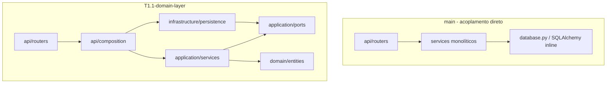

# Diff e Casos de Teste — Branch `T1.1-domain-layer` vs `main`

**Gerado em:** 19/06/2026  
**Branch:** `T1.1-domain-layer`  
**Base de comparação:** `main`  
**Comando:** `git diff main...HEAD`

## Resumo executivo

Esta branch implementa a **T1.1 — camada de domínio DDD**: separação explícita entre domínio, aplicação, infraestrutura e API, sem alterar o contrato REST público. Os routers continuam expondo os mesmos endpoints; a mudança é **estrutural** (inversão de dependência, composition root, testes por bounded context).

| Métrica | Valor |
|---------|-------|
| Arquivos alterados | 134 |
| Linhas adicionadas | +6.894 |
| Linhas removidas | −945 |
| Commits à frente de `main` | 12 |
| Casos de teste (pytest) | 134 |

### Commits incluídos

```
bef4523 test: organize test folder structure
7b0930f test: add architecture boundary checks
cc70e1e refactor: introduce DDD boundaries for auth
d65c0bd refactor: introduce DDD boundaries for billing
0491862 refactor: introduce DDD boundaries for execution/stock
02b6025 refactor: introduce DDD boundaries for inventory
a21e3af refactor: introduce DDD boundaries for service_orders
814ab7e refactor: introduce DDD boundaries for budget_approval
dd7a234 refactor: introduce DDD boundaries for budgets
53edfb4 refactor: introduce DDD boundaries for products and suppliers
c844f6b refactor: introduce DDD boundaries for service catalog
e276282 refactor: introduce DDD boundaries for customers
b220e63 refactor: introduce DDD boundaries for vehicles
```

### Arquitetura — antes e depois



---

## Mudanças por camada

### Domain (novo — 11 bounded contexts)

Cada contexto ganhou `entity.py` e `repository.py` (interface). Value objects onde aplicável (`customer`, `supplier`, `vehicle`).

| Arquivo | Status | Descrição |
|---------|--------|-----------|
| `src/domain/auth/` | A | Entidade `User`, repositório de autenticação |
| `src/domain/billing/` | A | Entidade `Invoice`, repositório de faturamento |
| `src/domain/budget/` | A | `Budget`, linhas de serviço/produto, disponibilidade |
| `src/domain/customer/` | A | `Customer`, `CustomerDocument` |
| `src/domain/execution/` | A | Fila de execução, retirada de estoque |
| `src/domain/inventory/` | A | Reservas, solicitações de compra, recebimentos |
| `src/domain/product/` | A | `Product` com regras de estoque |
| `src/domain/service_catalog/` | A | Serviços do catálogo e linhas de produto |
| `src/domain/service_order/` | A | OS, atribuição de mecânico, prioridade |
| `src/domain/supplier/` | A | `Supplier`, `SupplierDocument` |
| `src/domain/vehicle/` | A | `Vehicle`, `Plate` |

### Application

| Arquivo | Status | Descrição |
|---------|--------|-----------|
| `src/application/ports/*.py` | A | Protocolos: `UnitOfWork`, lookups, billing, execution, inventory, etc. |
| `src/application/services/auth_service.py` | A | Caso de uso de autenticação extraído |
| `src/application/services/service_order_email_service.py` | A | Envio de e-mail de OS via ports |
| `src/application/services/*_service.py` | M | Refatorados para depender de interfaces, não de `Session` |

### Infrastructure

| Arquivo | Status | Descrição |
|---------|--------|-----------|
| `src/infrastructure/persistence/*.py` | A | Implementações SQLAlchemy dos repositórios |
| `src/infrastructure/persistence/unit_of_work.py` | A | `SqlAlchemyUnitOfWork` |
| `src/infrastructure/budget_approval.py` | A | Adapters de aprovação de orçamento |
| `src/infrastructure/execution.py` | A | Adapters de execução |
| `src/infrastructure/service_order.py` | A | Adapters de OS |
| `src/infrastructure/billing.py` | A | Adapter de faturamento |
| `src/infrastructure/auth/jwt.py` | M | Desacoplado do service |
| `src/infrastructure/database.py` | M | Ajustes de mapeamento de enums |

### API

| Arquivo | Status | Descrição |
|---------|--------|-----------|
| `src/api/composition/*.py` | A | Composition root — wiring de services por contexto |
| `src/api/routers/*.py` | M | Usam `compose_*_service(db)` em vez de `XxxService(db)` |
| `src/api/dependencies.py` | M | Integração com novo `AuthService` |
| `src/main.py` | M | Registro de routers (sem mudança de contrato) |

### Testes

| Arquivo | Status | Descrição |
|---------|--------|-----------|
| `tests/unit/<domínio>/test_*_domain.py` | A | Testes de entidades e value objects por contexto |
| `tests/unit/<domínio>/test_*_service.py` | A | Testes de services com repositórios in-memory |
| `tests/unit/test_architecture_boundaries.py` | A | Guarda de imports entre camadas |
| `tests/unit/test_database_enum_mapping.py` | A | Enums persistem valores, não nomes |
| `tests/integration/test_api.py` | M | +2 testes CRUD; asserções extras em `test_full_flow` |
| `tests/unit/test_services.py` | D | Substituído por testes unitários por domínio |
| `tests/unit/test_budget_service.py` | D | Substituído por `tests/unit/budget/test_budget_service.py` |
| `tests/unit/test_validators.py` | — | Mantido sem alteração estrutural |
| `tests/conftest.py` | M | Ajustes menores de fixtures |

---

## Snippets selecionados

### 1. Composition root (`src/api/composition/budgets.py`)

O router não conhece SQLAlchemy; o composition root monta o `BudgetService` com todas as dependências:

```15:24:src/api/composition/budgets.py
def compose_budget_service(db: Session) -> BudgetService:
    return BudgetService(
        budgets=SqlAlchemyBudgetRepository(db),
        customers=SqlAlchemyCustomerLookup(db),
        vehicles=SqlAlchemyVehicleOwnershipLookup(db),
        services=SqlAlchemyBudgetServiceCatalogLookup(db),
        products=SqlAlchemyBudgetProductLookup(db),
        reservations=SqlAlchemyReservationLookup(db),
        uow=SqlAlchemyUnitOfWork(db),
    )
```

### 2. Router — antes vs depois (`customers`)

**`main` (acoplado à sessão):**

```python
from src.application.services.customer_service import CustomerService

return CustomerService(db).create(data.name, data.document, data.email, data.phone)
```

**`T1.1-domain-layer` (composition root):**

```4:21:src/api/routers/customers.py
from src.api.composition.customers import compose_customer_service
# ...
        return compose_customer_service(db).create(
            data.name, data.document, data.email, data.phone
        )
```

### 3. Regras de negócio no domínio (`src/domain/budget/entity.py`)

Cálculo de totais e previsão de entrega movidos para a entidade:

```132:147:src/domain/budget/entity.py
    def recalculate(
        self,
        service_hours: dict[int, float],
        now: datetime | None = None,
    ) -> None:
        self.total_price = sum(
            line.unit_price * line.quantity for line in self.service_lines
        ) + sum(line.unit_price * line.quantity for line in self.product_lines)

        total_hours = 0.0
        for line in self.service_lines:
            estimated_hours = service_hours.get(line.service_id)
            if estimated_hours is not None:
                total_hours += estimated_hours * line.quantity
        current_time = now or datetime.now(UTC).replace(tzinfo=None)
        self.estimated_delivery = current_time + timedelta(hours=max(total_hours, 1))
```

### 4. Port de aplicação (`src/application/ports/unit_of_work.py`)

```4:9:src/application/ports/unit_of_work.py
class UnitOfWork(Protocol):
    def commit(self) -> None:
        ...

    def rollback(self) -> None:
        ...
```

### 5. Guarda de arquitetura (`tests/unit/test_architecture_boundaries.py`)

```8:21:tests/unit/test_architecture_boundaries.py
DOMAIN_FORBIDDEN_IMPORTS = (
    "fastapi",
    "pydantic",
    "sqlalchemy",
    "src.api",
    "src.application",
    "src.infrastructure",
)
APPLICATION_SERVICE_FORBIDDEN_IMPORTS = (
    "fastapi",
    "sqlalchemy",
    "src.api",
    "src.infrastructure",
)
```

### 6. Padrão de teste de service sem SQLAlchemy

Repositório in-memory + `FakeUnitOfWork` substituem o banco:

```59:68:tests/unit/customer/test_customer_service.py
def test_customer_service_creates_customer_without_sqlalchemy():
    customers = InMemoryCustomerRepository()
    uow = FakeUnitOfWork()
    service = CustomerService(customers, uow)

    customer = service.create("Maria", "529.982.247-25", "maria@test.com")

    assert customer.id == 1
    assert customer.document == "52998224725"
    assert uow.commits == 1
```

---

## Catálogo de casos de teste

**Total:** 134 testes | **Em `main`:** 16 | **Nesta branch:** +118 (após reorganização) | **Removidos/substituídos:** 4

### Testes removidos de `main` (substituídos)

| Arquivo (main) | Teste | Substituído por |
|----------------|-------|-----------------|
| `tests/unit/test_services.py` | `test_service_order_status_transitions` | `tests/unit/service_order/`, `tests/unit/execution/` |
| `tests/unit/test_services.py` | `test_invoice_and_payment` | `tests/unit/billing/test_billing_service.py` |
| `tests/unit/test_services.py` | `test_inventory_reservation_and_purchase` | `tests/unit/inventory/test_inventory_service.py` |
| `tests/unit/test_budget_service.py` | `test_budget_total_calculation` | `tests/unit/budget/test_budget_domain.py`, `test_budget_service.py` |

---

### Integração — `tests/integration/test_api.py` (8 testes)

| Teste | Tipo | O que valida | Novo |
|-------|------|--------------|------|
| `test_health` | integração | Endpoint `/health` retorna 200 | Não |
| `test_login` | integração | Login admin retorna token JWT | Não |
| `test_customer_crud` | integração | CRUD completo de clientes via API | Não |
| `test_vehicle_crud` | integração | CRUD de veículos vinculados ao cliente | Não |
| `test_service_catalog_crud_and_product_lines` | integração | CRUD de serviços e linhas de produto | **Sim** |
| `test_products_and_suppliers_crud` | integração | CRUD de produtos/fornecedores, estoque, SKU duplicado | **Sim** |
| `test_full_flow` | integração | Fluxo orçamento → aprovação → OS → execução → fatura (+ availability e estimated-delivery) | Parcial* |
| `test_admin_requires_auth` | integração | Rotas admin exigem JWT | Não |

\* `test_full_flow` existia em `main`; ganhou asserções de disponibilidade e previsão de entrega nesta branch.

---

### Arquitetura e infraestrutura transversal (10 testes)

#### `tests/unit/test_architecture_boundaries.py`

| Teste | Tipo | O que valida | Novo |
|-------|------|--------------|------|
| `test_domain_does_not_depend_on_outer_layers_or_frameworks` | arquitetura | `domain/` não importa FastAPI, SQLAlchemy, API ou infra | **Sim** |
| `test_application_services_do_not_depend_on_api_or_infrastructure` | arquitetura | `application/services/` não importa API ou infra | **Sim** |

#### `tests/unit/test_database_enum_mapping.py`

| Teste | Tipo | O que valida | Novo |
|-------|------|--------------|------|
| `test_database_enums_persist_enum_values_not_names` | infra | Enums SQLAlchemy persistem `.value`, não `.name` | **Sim** |

#### `tests/unit/test_validators.py`

| Teste | Tipo | O que valida | Novo |
|-------|------|--------------|------|
| `test_valid_cpf` | domínio | CPF válido aceito | Não |
| `test_valid_cnpj` | domínio | CNPJ válido aceito | Não |
| `test_invalid_document` | domínio | Documento inválido rejeitado | Não |
| `test_legacy_plate` | domínio | Placa legado normalizada | Não |
| `test_mercosul_plate` | domínio | Placa Mercosul normalizada | Não |
| `test_invalid_plate` | domínio | Placa inválida rejeitada | Não |

---

### Auth — `tests/unit/auth/` (7 testes)

| Teste | Tipo | O que valida | Novo |
|-------|------|--------------|------|
| `test_user_create_defaults_to_active` | domínio | `User.create` define `active=True` | **Sim** |
| `test_auth_service_creates_default_admin_once` | serviço | Admin padrão criado apenas uma vez | **Sim** |
| `test_auth_service_login_returns_access_token` | serviço | Login válido retorna token | **Sim** |
| `test_auth_service_login_rejects_invalid_credentials` | serviço | Credenciais inválidas rejeitadas | **Sim** |
| `test_auth_service_get_current_user_decodes_token_and_loads_active_user` | serviço | Token decodificado e usuário ativo carregado | **Sim** |
| `test_auth_service_get_current_user_rejects_inactive_user` | serviço | Usuário inativo rejeitado | **Sim** |
| `test_auth_service_get_current_user_propagates_invalid_token` | serviço | Token inválido propaga erro | **Sim** |

---

### Billing — `tests/unit/billing/` (9 testes)

| Teste | Tipo | O que valida | Novo |
|-------|------|--------------|------|
| `test_invoice_create_defaults_to_pending_status` | domínio | Fatura criada com status pendente | **Sim** |
| `test_invoice_pay_sets_status_and_paid_at` | domínio | Pagamento define status e `paid_at` | **Sim** |
| `test_invoice_service_creates_invoice_without_sqlalchemy` | serviço | Criação de fatura via ports in-memory | **Sim** |
| `test_invoice_service_rejects_missing_service_order` | serviço | OS inexistente rejeitada | **Sim** |
| `test_invoice_service_rejects_non_finalized_service_order` | serviço | OS não finalizada rejeitada | **Sim** |
| `test_invoice_service_rejects_duplicate_invoice` | serviço | Fatura duplicada para mesma OS rejeitada | **Sim** |
| `test_invoice_service_pays_invoice_and_delivers_service_order` | serviço | Pagamento marca OS como entregue | **Sim** |
| `test_invoice_service_rejects_missing_invoice` | serviço | Fatura inexistente rejeitada | **Sim** |
| `test_invoice_service_delivers_service_order` | serviço | Entrega da OS após pagamento | **Sim** |

---

### Budget — `tests/unit/budget/` (11 testes)

| Teste | Tipo | O que valida | Novo |
|-------|------|--------------|------|
| `test_budget_create_sets_default_status_and_totals` | domínio | Orçamento criado em rascunho com totais zerados | **Sim** |
| `test_budget_add_lines_and_recalculate_totals` | domínio | Linhas somam `total_price` corretamente | **Sim** |
| `test_budget_recalculate_uses_minimum_one_hour_delivery` | domínio | Previsão mínima de 1 hora | **Sim** |
| `test_budget_rejects_non_positive_line_quantity` | domínio | Quantidade ≤ 0 rejeitada | **Sim** |
| `test_product_availability_serializes_to_api_shape` | domínio | Disponibilidade serializa para API | **Sim** |
| `test_budget_service_creates_budget_without_sqlalchemy` | serviço | Criação via ports in-memory | **Sim** |
| `test_budget_service_rejects_missing_customer` | serviço | Cliente inexistente rejeitado | **Sim** |
| `test_budget_service_rejects_vehicle_from_another_customer` | serviço | Veículo de outro cliente rejeitado | **Sim** |
| `test_budget_service_adds_service_line_and_derived_products` | serviço | Linha de serviço deriva produtos do catálogo | **Sim** |
| `test_budget_service_adds_manual_product_line` | serviço | Linha de produto manual adicionada | **Sim** |
| `test_budget_service_checks_availability` | serviço | Verificação de estoque por produto | **Sim** |

---

### Budget Approval — `tests/unit/budget_approval/` (9 testes)

| Teste | Tipo | O que valida | Novo |
|-------|------|--------------|------|
| `test_budget_mark_sent_stores_token_and_status` | domínio | Envio armazena token e status `SENT` | **Sim** |
| `test_budget_approve_changes_status` | domínio | Aprovação muda status | **Sim** |
| `test_budget_approve_rejects_already_approved_budget` | domínio | Reaprovação rejeitada | **Sim** |
| `test_budget_reject_changes_status` | domínio | Rejeição muda status | **Sim** |
| `test_send_budget_email_marks_budget_sent_and_sends_email` | serviço | E-mail enviado e orçamento marcado | **Sim** |
| `test_approve_budget_marks_budget_approved_and_creates_service_order` | serviço | Aprovação cria OS automaticamente | **Sim** |
| `test_approve_budget_rejects_missing_token` | serviço | Token inválido rejeitado | **Sim** |
| `test_approve_budget_rejects_already_approved_budget_without_commit` | serviço | Orçamento já aprovado rejeitado | **Sim** |
| `test_reject_budget_marks_budget_rejected` | serviço | Rejeição persiste status | **Sim** |

---

### Customer — `tests/unit/customer/` (10 testes)

| Teste | Tipo | O que valida | Novo |
|-------|------|--------------|------|
| `test_customer_document_normalizes_cpf` | domínio | CPF normalizado (só dígitos) | **Sim** |
| `test_customer_document_normalizes_cnpj` | domínio | CNPJ normalizado | **Sim** |
| `test_customer_document_rejects_invalid_document` | domínio | Documento inválido rejeitado | **Sim** |
| `test_customer_create_normalizes_document` | domínio | `Customer.create` normaliza documento | **Sim** |
| `test_customer_updates_only_provided_contact_fields` | domínio | Update parcial de contato | **Sim** |
| `test_customer_service_creates_customer_without_sqlalchemy` | serviço | Criação via repositório in-memory | **Sim** |
| `test_customer_service_rejects_duplicate_document` | serviço | Documento duplicado → `ConflictError` | **Sim** |
| `test_customer_service_gets_customer_by_document` | serviço | Busca por documento | **Sim** |
| `test_customer_service_updates_customer_contact_fields` | serviço | Atualização de e-mail/telefone | **Sim** |
| `test_customer_service_raises_when_customer_is_missing` | serviço | Cliente inexistente → `NotFoundError` | **Sim** |

---

### Execution — `tests/unit/execution/` (11 testes)

| Teste | Tipo | O que valida | Novo |
|-------|------|--------------|------|
| `test_stock_withdrawal_create_defaults_to_pending_status` | domínio | Retirada criada como pendente | **Sim** |
| `test_stock_withdrawal_rejects_non_positive_quantity` | domínio | Quantidade inválida rejeitada | **Sim** |
| `test_enqueue_service_order_requires_waiting_approval_status` | domínio | Enfileiramento exige status correto | **Sim** |
| `test_start_service_order_sets_status_and_started_at` | domínio | Início define status e timestamp | **Sim** |
| `test_finish_service_order_requires_in_progress_status` | domínio | Finalização exige OS em progresso | **Sim** |
| `test_execution_service_starts_service_order_without_sqlalchemy` | serviço | Início de OS via ports | **Sim** |
| `test_execution_service_rejects_missing_service_order` | serviço | OS inexistente rejeitada | **Sim** |
| `test_execution_service_rejects_invalid_start_status` | serviço | Status inválido para início | **Sim** |
| `test_execution_service_finishes_order_and_consumes_inventory` | serviço | Finalização consome estoque | **Sim** |
| `test_execution_service_requests_stock_withdrawal_and_sends_email` | serviço | Solicita retirada e envia e-mail | **Sim** |
| `test_execution_service_lists_orders_with_fulfilled_withdrawals` | serviço | Lista OS com retiradas atendidas | **Sim** |

---

### Inventory — `tests/unit/inventory/` (13 testes)

| Teste | Tipo | O que valida | Novo |
|-------|------|--------------|------|
| `test_reservation_create_defaults_to_active_status` | domínio | Reserva criada como ativa | **Sim** |
| `test_purchase_request_create_defaults_to_pending_status` | domínio | Solicitação de compra pendente | **Sim** |
| `test_purchase_request_mark_received_changes_status` | domínio | Recebimento altera status | **Sim** |
| `test_goods_receipt_rejects_non_positive_quantity` | domínio | Quantidade ≤ 0 rejeitada | **Sim** |
| `test_inventory_service_creates_reservation_without_sqlalchemy` | serviço | Reserva via ports | **Sim** |
| `test_inventory_service_creates_reservations_for_service_order` | serviço | Reservas automáticas para OS | **Sim** |
| `test_inventory_service_creates_purchase_request_for_insufficient_stock` | serviço | Compra automática se estoque insuficiente | **Sim** |
| `test_inventory_service_does_not_duplicate_pending_receipt` | serviço | Não duplica recebimento pendente | **Sim** |
| `test_inventory_service_rejects_missing_service_order` | serviço | OS inexistente rejeitada | **Sim** |
| `test_inventory_service_creates_purchase_request` | serviço | Criação manual de solicitação | **Sim** |
| `test_inventory_service_rejects_missing_product` | serviço | Produto inexistente rejeitado | **Sim** |
| `test_inventory_service_registers_receipt_and_updates_stock` | serviço | Recebimento atualiza estoque | **Sim** |
| `test_inventory_service_lists_pending_receipts` | serviço | Lista recebimentos pendentes | **Sim** |

---

### Product — `tests/unit/product/` (11 testes)

| Teste | Tipo | O que valida | Novo |
|-------|------|--------------|------|
| `test_product_create_preserves_fields` | domínio | Campos preservados na criação | **Sim** |
| `test_product_rejects_non_positive_price` | domínio | Preço ≤ 0 rejeitado | **Sim** |
| `test_product_rejects_negative_initial_stock` | domínio | Estoque inicial negativo rejeitado | **Sim** |
| `test_product_updates_details_and_stock` | domínio | Atualização de detalhes e estoque | **Sim** |
| `test_product_rejects_negative_final_stock` | domínio | Estoque final negativo rejeitado | **Sim** |
| `test_product_service_creates_product_without_sqlalchemy` | serviço | Criação via ports | **Sim** |
| `test_product_service_rejects_duplicate_sku` | serviço | SKU duplicado rejeitado | **Sim** |
| `test_product_service_updates_product_details` | serviço | Atualização de nome/preço | **Sim** |
| `test_product_service_updates_stock` | serviço | Ajuste de estoque | **Sim** |
| `test_product_service_rejects_insufficient_stock` | serviço | Estoque insuficiente rejeitado | **Sim** |
| `test_product_service_raises_when_product_is_missing` | serviço | Produto inexistente → erro | **Sim** |

---

### Service Catalog — `tests/unit/service_catalog/` (11 testes)

| Teste | Tipo | O que valida | Novo |
|-------|------|--------------|------|
| `test_catalog_service_create_preserves_fields` | domínio | Serviço criado com campos corretos | **Sim** |
| `test_catalog_service_rejects_non_positive_base_price` | domínio | Preço base ≤ 0 rejeitado | **Sim** |
| `test_catalog_service_updates_only_provided_fields` | domínio | Update parcial | **Sim** |
| `test_service_product_line_rejects_non_positive_quantity` | domínio | Quantidade inválida na linha | **Sim** |
| `test_service_product_line_create_preserves_fields` | domínio | Linha de produto preserva campos | **Sim** |
| `test_service_catalog_creates_service_without_sqlalchemy` | serviço | Criação via ports | **Sim** |
| `test_service_catalog_updates_service` | serviço | Atualização de serviço | **Sim** |
| `test_service_catalog_rejects_missing_service` | serviço | Serviço inexistente rejeitado | **Sim** |
| `test_service_catalog_adds_product_line` | serviço | Adiciona linha de produto | **Sim** |
| `test_service_catalog_rejects_missing_product` | serviço | Produto inexistente rejeitado | **Sim** |
| `test_service_catalog_removes_product_line` | serviço | Remove linha de produto | **Sim** |

---

### Service Order — `tests/unit/service_order/` (9 testes)

| Teste | Tipo | O que valida | Novo |
|-------|------|--------------|------|
| `test_service_order_assign_mechanic_sets_status` | domínio | Atribuição muda status para diagnóstico | **Sim** |
| `test_service_order_sets_priority` | domínio | Prioridade definida na entidade | **Sim** |
| `test_service_order_service_lists_and_filters_orders_without_sqlalchemy` | serviço | Listagem e filtros via ports | **Sim** |
| `test_service_order_service_assigns_mechanic_and_commits` | serviço | Atribuição persiste com commit | **Sim** |
| `test_service_order_service_sets_priority_and_commits` | serviço | Prioridade persiste com commit | **Sim** |
| `test_service_order_service_tracks_by_customer_document` | serviço | Rastreamento por CPF/CNPJ | **Sim** |
| `test_service_order_service_rejects_wrong_customer_document` | serviço | Documento incorreto rejeitado | **Sim** |
| `test_service_order_service_calculates_average_execution_time` | serviço | Tempo médio de execução | **Sim** |
| `test_service_order_email_service_uses_ports` | serviço | E-mail de OS via ports de e-mail | **Sim** |

---

### Supplier — `tests/unit/supplier/` (7 testes)

| Teste | Tipo | O que valida | Novo |
|-------|------|--------------|------|
| `test_supplier_document_normalizes_cnpj` | domínio | CNPJ normalizado | **Sim** |
| `test_supplier_document_rejects_invalid_document` | domínio | Documento inválido rejeitado | **Sim** |
| `test_supplier_create_normalizes_document` | domínio | `Supplier.create` normaliza CNPJ | **Sim** |
| `test_supplier_updates_only_provided_contact_fields` | domínio | Update parcial de contato | **Sim** |
| `test_supplier_service_creates_supplier_without_sqlalchemy` | serviço | Criação via ports | **Sim** |
| `test_supplier_service_updates_supplier_contact_fields` | serviço | Atualização de contato | **Sim** |
| `test_supplier_service_raises_when_supplier_is_missing` | serviço | Fornecedor inexistente → erro | **Sim** |

---

### Vehicle — `tests/unit/vehicle/` (9 testes)

| Teste | Tipo | O que valida | Novo |
|-------|------|--------------|------|
| `test_plate_normalizes_legacy_format` | domínio | Placa legado normalizada | **Sim** |
| `test_plate_normalizes_mercosul_format` | domínio | Placa Mercosul normalizada | **Sim** |
| `test_plate_rejects_invalid_format` | domínio | Placa inválida rejeitada | **Sim** |
| `test_vehicle_create_validates_and_normalizes_fields` | domínio | Criação valida placa e ano | **Sim** |
| `test_vehicle_rejects_invalid_year` | domínio | Ano inválido rejeitado | **Sim** |
| `test_vehicle_updates_details_through_domain_behavior` | domínio | Update via comportamento de domínio | **Sim** |
| `test_vehicle_service_creates_vehicle_without_sqlalchemy` | serviço | Criação via ports | **Sim** |
| `test_vehicle_service_rejects_unknown_customer` | serviço | Cliente inexistente rejeitado | **Sim** |
| `test_vehicle_service_rejects_duplicate_plate` | serviço | Placa duplicada rejeitada | **Sim** |

---

## Como executar e validar

```bash
# Suite completa com cobertura
poetry run pytest --cov=src --cov-report=term-missing

# Guardas de arquitetura
poetry run pytest tests/unit/test_architecture_boundaries.py -v

# Apenas testes de integração
poetry run pytest tests/integration/ -v

# Apenas um domínio (exemplo)
poetry run pytest tests/unit/budget/ -v
```

---

## Rastreabilidade

| Referência | Relação com esta branch |
|------------|-------------------------|
| [docs/tasks.md](tasks.md) — estrutura em camadas | A branch materializa a separação `domain/` → `application/` → `infrastructure/` → `api/` descrita no plano de tarefas |
| T12 (testes 80% domínios críticos) | Cobertura ampliada com 127 testes novos organizados por bounded context |
| RF01–RF40 | Comportamento funcional preservado; mudança é de arquitetura interna |

**Nota:** O contrato da API REST (`/api/v1/admin/*`, `/api/v1/public/*`) permanece equivalente. Clientes e integrações externas não precisam de alteração por causa desta refatoração.
