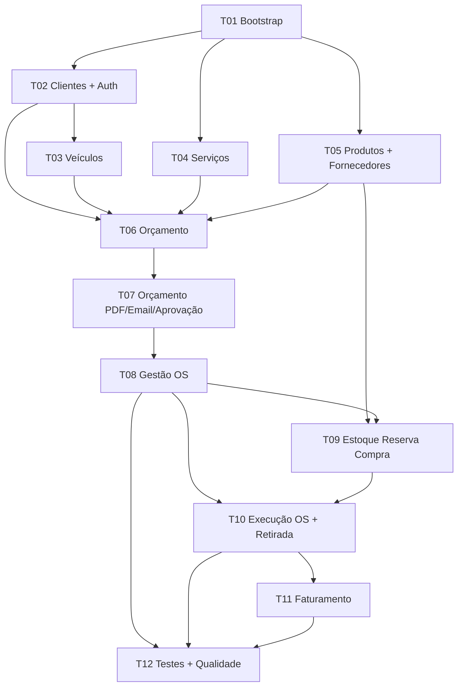

---

name: Developer Tasks FastAPI

overview: Break down the 15SOAT Phase 1 mechanic workshop backend (FastAPI monolith) into 13 developer tasks that cover all 40 functional requirements (RF01–RF40), with explicit traceability and dependency ordering aligned to the PDF challenge constraints.

todos:

  - id: t01-bootstrap

    content: "T01: FastAPI project bootstrap — layered structure, DB, Alembic, Docker, Swagger, README"

    status: completed

  - id: t02-customers-auth

    content: "T02: Customer CRUD + CPF/CNPJ validation (RF01, RF05) + JWT admin auth"

    status: completed

  - id: t03-vehicles

    content: "T03: Vehicle CRUD linked to customer + plate validation (RF02)"

    status: completed

  - id: t04-services

    content: "T04: Service catalog CRUD + product lines per service (RF04, RF09)"

    status: completed

  - id: t05-products-stock

    content: "T05: Products, suppliers, stock updates (RF03, RF29, RF30)"

    status: completed

  - id: t06-budget

    content: "T06: Budget creation — service/product lines, totals, availability, ETA (RF06, RF08–RF14)"

    status: completed

  - id: t07-budget-approval

    content: "T07: Budget PDF, email, approve/reject, auto OS (RF15–RF18)"

    status: completed

  - id: t08-os-management

    content: "T08: OS management — assignment, priority, status, PDF email, client tracking (RF07, RF19, RF26–RF28)"

    status: completed

  - id: t09-inventory-procurement

    content: "T09: Reservations, purchase requests, receipts (RF20–RF25)"

    status: completed

  - id: t10-execution

    content: "T10: Execution queue, start/finish, stock withdrawal flow (RF31–RF37)"

    status: completed

  - id: t11-billing

    content: "T11: Invoice generation, payment, OS closure (RF38–RF40)"

    status: completed

  - id: t12-quality

    content: "T12: Unit/integration tests (80% critical domains) + security scan report"

    status: completed

isProject: false

---

# Developer Task Plan — Oficina Mecânica (FastAPI)

## Context

**Domain:** Integrated workshop system for service orders (OS), budgets (orçamentos), customers, vehicles, parts/inventory, and billing.

**Stack:** Python + FastAPI, layered monolith, REST + OpenAPI/Swagger, Docker/docker-compose, JWT on admin APIs, automated tests (80% on critical domains).

**Sources:**

- Challenge brief: `15SOAT - Fase 1 - Tech Challenge.pdf`](C:\Users\Usuario\Documents\Projects\FIAP\Tech Challange 1\15SOAT - Fase 1 - Tech Challenge.pdf)

- Functional requirements: RF01–RF40 from Notion export CSV

## Recommended project layout

```

src/

  domain/          # entities, value objects, domain services, status enums

  application/     # use cases / services

  infrastructure/  # SQLAlchemy repos, email, PDF, JWT

  api/             # FastAPI routers, Pydantic schemas, dependencies

tests/

  unit/

  integration/

docker-compose.yml

Dockerfile

```

**Suggested packages:** `fastapi`, `uvicorn`, `sqlalchemy`, `alembic`, `pydantic`, `python-jose`, `passlib`, `reportlab` or `weasyprint`, `aiosmtplib`, `pytest`, `httpx`, `validate-docbr` (CPF/CNPJ).

## OS status flow (from PDF + RFs)


## Task dependency graph



---

## Developer tasks (with RF traceability)

### T01 — Project bootstrap and infrastructure

**Depends on:** none

**Goal:** Runnable FastAPI monolith with layered architecture, DB, migrations, Swagger, Docker.

**Deliverables:**

- FastAPI app factory, health check, OpenAPI at `/docs`

- SQLAlchemy + Alembic (recommend **PostgreSQL**; justify in README)

- Base domain exceptions and API error handler

- `Dockerfile` + `docker-compose.yml` (app + DB)

- `README.md` with local run instructions

**Functional requirements:** none (supports PDF technical requirements)

**PDF alignment:** monolithic backend, REST + Swagger, Docker, README, DB justification

---

### T02 — Customer management, identification, and admin authentication

**Depends on:** T01

**Goal:** Admin-protected customer APIs with CPF/CNPJ validation and client lookup by document.

**APIs (examples):**

- `POST/GET/PUT/DELETE /api/v1/admin/customers`

- `GET /api/v1/customers/by-document/{cpf_cnpj}` (public/client tracking entry point per PDF)

**Functional requirements:**

| RF | Title |

|----|-------|

| **RF01** | Gestão do Cliente |

| **RF05** | Validação de CNPJ (extend to CPF per PDF) |

**PDF alignment:** CRUD clientes, identificação por CPF/CNPJ, JWT em APIs administrativas, validação de dados sensíveis

**Notes:** Implement CPF/CNPJ as value objects in `domain/`; JWT dependency guards `/admin/`* routes.

---

### T03 — Vehicle management

**Depends on:** T02

**Goal:** CRUD vehicles linked to customers with plate validation.

**APIs:**

- `POST/GET/PUT/DELETE /api/v1/admin/vehicles`

- `GET /api/v1/admin/customers/{id}/vehicles`

**Functional requirements:**

| RF | Title |

|----|-------|

| **RF02** | Gestão do Veículo |

**PDF alignment:** cadastro de veículo (placa, marca, modelo, ano)

**Notes:** Validate Brazilian plate formats (Mercosul + legacy) in domain layer.

---

### T04 — Service catalog and service-product composition

**Depends on:** T01

**Goal:** Admin CRUD for workshop services; each service template can reference multiple product lines (BOM).

**APIs:**

- `POST/GET/PUT/DELETE /api/v1/admin/services`

- `POST/DELETE /api/v1/admin/services/{id}/product-lines`

**Functional requirements:**

| RF | Title |

|----|-------|

| **RF04** | Gestão de Serviços |

| **RF09** | Serviço com múltiplas linhas de produto |

**PDF alignment:** CRUD de serviços

---

### T05 — Products, suppliers, and stock management

**Depends on:** T01

**Goal:** CRUD parts/supplies with stock quantity; supplier registry; stock adjustment endpoint.

**APIs:**

- `POST/GET/PUT/DELETE /api/v1/admin/products`

- `POST/GET/PUT/DELETE /api/v1/admin/suppliers`

- `PATCH /api/v1/admin/products/{id}/stock`

**Functional requirements:**

| RF | Title |

|----|-------|

| **RF03** | Gestão de Produtos (Peças e Insumos) |

| **RF29** | Gestão de fornecedor |

| **RF30** | Atualização do estoque |

**PDF alignment:** CRUD de peças/insumos com controle de estoque

---

### T06 — Budget (orçamento) creation and composition

**Depends on:** T02, T03, T04, T05

**Goal:** Create budgets for a customer/vehicle with multiple service lines, derived/extra product lines, totals, availability check, and estimated delivery date.

**APIs:**

- `POST/GET/PUT /api/v1/admin/budgets`

- `POST /api/v1/admin/budgets/{id}/service-lines`

- `POST /api/v1/admin/budgets/{id}/product-lines` (from services + ad-hoc)

- `GET /api/v1/admin/budgets/{id}/availability`

- `GET /api/v1/admin/budgets/{id}/estimated-delivery`

**Functional requirements:**

| RF | Title |

|----|-------|

| **RF06** | Gestão de Orçamento |

| **RF08** | Múltiplas linhas de serviços em orçamento |

| **RF10** | Linhas de produto dos serviços no orçamento |

| **RF11** | Adição de novas linhas de produto |

| **RF12** | Cálculo do preço total do orçamento |

| **RF13** | Consulta disponibilidade de produtos |

| **RF14** | Cálculo da data prevista de entrega |

**PDF alignment:** inclusão de serviços/peças, orçamento automático

**Notes:** RF12 should recalculate on every line change; RF13 reads stock minus active reservations (stub reservations until T09).

---

### T07 — Budget PDF, email delivery, and client approval

**Depends on:** T06

**Goal:** Generate budget PDF, email it to the client, expose approve/reject action, and auto-create OS on approval.

**APIs / endpoints:**

- `POST /api/v1/admin/budgets/{id}/send-email`

- `GET /api/v1/public/budgets/{token}/approve`

- `GET /api/v1/public/budgets/{token}/reject`

- `POST /api/v1/internal/budgets/{id}/generate-os` (called by approval handler)

**Functional requirements:**

| RF | Title |

|----|-------|

| **RF15** | Gerar PDF do orçamento |

| **RF16** | Enviar orçamento via email |

| **RF17** | Email com ação de aprovação/recusa |

| **RF18** | Gerar OS automaticamente a partir da resposta do orçamento |

**PDF alignment:** envio do orçamento ao cliente para aprovação

**Notes:** Use signed token URLs for RF17; on approval set OS status to `Aguardando Aprovação` → transition per workflow when linked approval exists (RF31 in T10).

---

### T08 — Service order (OS) management and assignment

**Depends on:** T07, T02, T03

**Goal:** Full OS lifecycle management: list/detail, mechanic assignment, priority, automatic status transitions, OS PDF email, client progress query.

**APIs:**

- `GET/PUT /api/v1/admin/service-orders`

- `GET /api/v1/admin/service-orders/{id}`

- `PATCH /api/v1/admin/service-orders/{id}/assign-mechanic`

- `PATCH /api/v1/admin/service-orders/{id}/priority`

- `POST /api/v1/admin/service-orders/{id}/send-email`

- `GET /api/v1/public/service-orders/{id}?document=...` (client tracking per PDF)

**Functional requirements:**

| RF | Title |

|----|-------|

| **RF07** | Gestão de OS |

| **RF19** | Enviar PDF da OS por email |

| **RF26** | Atribuição de mecânico responsável |

| **RF27** | Status “Em Diagnóstico” após atribuição |

| **RF28** | Atribuição de prioridade |

**PDF alignment:** acompanhamento da OS (statuses), listagem/detalhamento, consulta pelo cliente via API, monitoramento de tempo médio de execução (add metric endpoint or query on finalized OS)

---

### T09 — Reservations, purchase requests, and goods receipt

**Depends on:** T05, T08

**Goal:** When OS contains products, create reservations; for unavailable items, check pending receipts, create purchase requests, and register receipts that update stock.

**APIs:**

- `POST/GET /api/v1/admin/reservations`

- `POST/GET /api/v1/admin/purchase-requests`

- `POST /api/v1/admin/purchase-requests/{id}/receipt`

- `GET /api/v1/admin/products/{id}/pending-receipts`

**Functional requirements:**

| RF | Title |

|----|-------|

| **RF20** | Gestão de Reserva |

| **RF21** | Gestão de Solicitação de Compra |

| **RF22** | Pesquisar recebimento para produtos indisponíveis |

| **RF23** | Gerar solicitação de compra (sem estoque e sem recebimento) |

| **RF24** | Gerar recebimento para pedido de compra |

| **RF25** | Gerar reserva quando produto na OS |

**Notes:** RF22–RF23 logic belongs in a domain service invoked during RF13/R25 flows.

---

### T10 — Execution queue, service execution, and stock withdrawal

**Depends on:** T08, T09

**Goal:** Move approved OS into execution queue, start/finish service, request stock withdrawals, notify stockkeeper, monitor OS with withdrawn parts, and reconcile stock/reservations/OS at end.

**APIs:**

- `POST /api/v1/admin/service-orders/{id}/enqueue`

- `PATCH /api/v1/admin/service-orders/{id}/start`

- `PATCH /api/v1/admin/service-orders/{id}/finish`

- `POST /api/v1/admin/stock-withdrawals`

- `GET /api/v1/admin/stock-withdrawals/pending`

- `GET /api/v1/admin/service-orders/in-progress/with-withdrawals`

**Functional requirements:**

| RF | Title |

|----|-------|

| **RF31** | Alocar OS aprovada na fila de execução |

| **RF32** | Informar início de atendimento |

| **RF33** | Informar finalização de atendimento |

| **RF34** | Solicitação de retirada de estoque |

| **RF35** | Notificar estoquista da retirada |

| **RF36** | Monitorar OS com produto retirado |

| **RF37** | Atualizar reserva, estoque e OS ao final do atendimento |

**PDF alignment:** status `Em execução` → `Finalizada`; automatic status changes on system actions

**Notes:** RF35 can use email event or internal notification table; RF37 runs in finish-service use case (commit stock, release/adjust reservations, set OS `Finalizada`).

---

### T11 — Invoicing and payment closure

**Depends on:** T10

**Goal:** Generate invoice for finalized OS, record payment, and close OS as delivered.

**APIs:**

- `POST /api/v1/admin/service-orders/{id}/invoice`

- `PATCH /api/v1/admin/invoices/{id}/pay`

- `PATCH /api/v1/admin/service-orders/{id}/deliver`

**Functional requirements:**

| RF | Title |

|----|-------|

| **RF38** | Gerar fatura para OS finalizada |

| **RF39** | Informar pagamento da fatura |

| **RF40** | Atualizar e encerrar OS após pagamento |

**PDF alignment:** status `Entregue` after payment/closure

---

### T12 — Automated tests, security validation, and API hardening

**Depends on:** T08, T10, T11 (run in parallel once core flows exist; finalize after T11)

**Goal:** 80%+ coverage on critical domains; integration tests for main flows; vulnerability scan documented.

**Scope:**

- Unit tests: CPF/CNPJ/plate validators, budget total (RF12), status transitions (RF27, RF31–RF33, RF40)

- Integration tests: budget → email approval → OS → execution → invoice (RF06–RF18, RF31–RF40)

- Security: JWT enforcement, input validation, dependency scan (e.g. `pip-audit` / Bandit) for delivery report

**Functional requirements:** cross-cutting validation of all RFs

**PDF alignment:** testes unitários e de integração, análise de vulnerabilidades, validação de dados sensíveis

---

## Complete RF → Task index

| RF | Task |

|----|------|

| RF01 | T02 |

| RF02 | T03 |

| RF03 | T05 |

| RF04 | T04 |

| RF05 | T02 |

| RF06 | T06 |

| RF07 | T08 |

| RF08 | T06 |

| RF09 | T04 |

| RF10 | T06 |

| RF11 | T06 |

| RF12 | T06 |

| RF13 | T06 |

| RF14 | T06 |

| RF15 | T07 |

| RF16 | T07 |

| RF17 | T07 |

| RF18 | T07 |

| RF19 | T08 |

| RF20 | T09 |

| RF21 | T09 |

| RF22 | T09 |

| RF23 | T09 |

| RF24 | T09 |

| RF25 | T09 |

| RF26 | T08 |

| RF27 | T08 |

| RF28 | T08 |

| RF29 | T05 |

| RF30 | T05 (+ T10 RF37 for consumption-side updates) |

| RF31 | T10 |

| RF32 | T10 |

| RF33 | T10 |

| RF34 | T10 |

| RF35 | T10 |

| RF36 | T10 |

| RF37 | T10 |

| RF38 | T11 |

| RF39 | T11 |

| RF40 | T11 |

---

## Suggested team parallelization

| Sprint / phase | Tasks | Can start after |

|----------------|-------|-----------------|

| Phase 0 | T01 | — |

| Phase 1 (parallel) | T02, T04, T05 | T01 |

| Phase 2 | T03 | T02 |

| Phase 3 | T06 | T02, T03, T04, T05 |

| Phase 4 | T07 | T06 |

| Phase 5 (parallel) | T08, T09 | T07 (+ T05 for T09) |

| Phase 6 | T10 | T08, T09 |

| Phase 7 | T11 | T10 |

| Phase 8 | T12 | T11 |

**Critical path:** T01 → T02 → T06 → T07 → T08 → T10 → T11 → T12

---

## Out-of-code deliverables (PDF, not dev tasks)

These are required for grading but separate from the RF implementation backlog:

- DDD documentation (Event Storming: OS flow + parts/inventory flow)

- 15-minute demo video

- Delivery PDF with group info and vulnerability report

---

## Definition of done (per task)

- Endpoint(s) documented in Swagger

- Domain logic in `application/` / `domain/` (not in router handlers)

- Migrations included for new tables

- At least smoke integration test for happy path

- Admin routes require JWT; public approval/tracking routes use token or document validation

