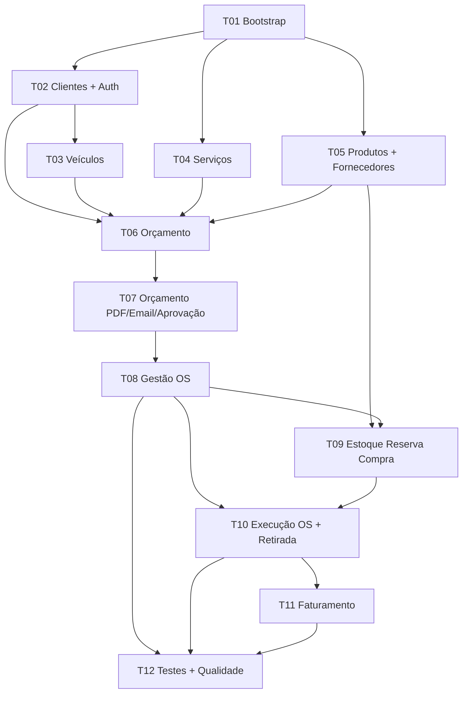

# Plano de Tarefas para Desenvolvedores — Oficina Mecânica (FastAPI)

## Contexto

**Domínio:** Sistema integrado de oficina para ordens de serviço (OS), orçamentos, clientes, veículos, peças/estoque e faturamento.

**Stack:** Python + FastAPI, monolito em camadas, REST + OpenAPI/Swagger, Docker/docker-compose, JWT nas APIs administrativas, testes automatizados (80% nos domínios críticos).

**Fontes:**

- Briefing do desafio: [`15SOAT - Fase 1 - Tech Challenge.pdf`](../15SOAT%20-%20Fase%201%20-%20Tech%20Challenge.pdf)
- Requisitos funcionais: RF01–RF40 (exportação CSV do Notion)

## Estrutura recomendada do projeto

```
src/
  domain/          # entidades, value objects, serviços de domínio, enums de status
  application/     # casos de uso / services
  infrastructure/  # repositórios SQLAlchemy, e-mail, PDF, JWT
  api/             # routers FastAPI, schemas Pydantic, dependencies
tests/
  unit/
  integration/
docker-compose.yml
Dockerfile
```

**Pacotes sugeridos:** `fastapi`, `uvicorn`, `sqlalchemy`, `alembic`, `pydantic`, `python-jose`, `passlib`, `reportlab` ou `weasyprint`, `aiosmtplib`, `pytest`, `httpx`, `validate-docbr` (CPF/CNPJ).

## Fluxo de status da OS (PDF + RFs)


## Grafo de dependências entre tarefas



---

## Tarefas de desenvolvimento (com rastreabilidade aos RFs)

### T01 — Bootstrap do projeto e infraestrutura

**Depende de:** nenhuma

**Objetivo:** Monolito FastAPI executável com arquitetura em camadas, banco de dados, migrations, Swagger e Docker.

**Entregas:**

- Factory da aplicação FastAPI, health check, OpenAPI em `/docs`
- SQLAlchemy + Alembic (recomenda-se **PostgreSQL**; justificar no README)
- Exceções base de domínio e handler de erros da API
- `Dockerfile` + `docker-compose.yml` (app + DB)
- `README.md` com instruções de execução local

**Requisitos funcionais:** nenhum (suporta requisitos técnicos do PDF)

**Alinhamento ao PDF:** back-end monolítico, REST + Swagger, Docker, README, justificativa do banco

---

### T02 — Gestão de clientes, identificação e autenticação administrativa

**Depende de:** T01

**Objetivo:** APIs de clientes protegidas por admin, com validação de CPF/CNPJ e consulta de cliente por documento.

**APIs (exemplos):**

- `POST/GET/PUT/DELETE /api/v1/admin/customers`
- `GET /api/v1/customers/by-document/{cpf_cnpj}` (ponto de entrada público/acompanhamento do cliente conforme PDF)

**Requisitos funcionais:**

| RF | Título |
|----|--------|
| **RF01** | Gestão do Cliente |
| **RF05** | Validação de CNPJ (estender para CPF conforme PDF) |

**Alinhamento ao PDF:** CRUD de clientes, identificação por CPF/CNPJ, JWT em APIs administrativas, validação de dados sensíveis

**Observações:** Implementar CPF/CNPJ como value objects em `domain/`; dependency JWT protege rotas `/admin/*`.

---

### T03 — Gestão de veículos

**Depende de:** T02

**Objetivo:** CRUD de veículos vinculados a clientes, com validação de placa.

**APIs:**

- `POST/GET/PUT/DELETE /api/v1/admin/vehicles`
- `GET /api/v1/admin/customers/{id}/vehicles`

**Requisitos funcionais:**

| RF | Título |
|----|--------|
| **RF02** | Gestão do Veículo |

**Alinhamento ao PDF:** cadastro de veículo (placa, marca, modelo, ano)

**Observações:** Validar formatos de placa brasileira (Mercosul + legado) na camada de domínio.

---

### T04 — Catálogo de serviços e composição serviço-produto

**Depende de:** T01

**Objetivo:** CRUD administrativo de serviços da oficina; cada template de serviço pode referenciar múltiplas linhas de produto (BOM).

**APIs:**

- `POST/GET/PUT/DELETE /api/v1/admin/services`
- `POST/DELETE /api/v1/admin/services/{id}/product-lines`

**Requisitos funcionais:**

| RF | Título |
|----|--------|
| **RF04** | Gestão de Serviços |
| **RF09** | Serviço com múltiplas linhas de produto |

**Alinhamento ao PDF:** CRUD de serviços

---

### T05 — Produtos, fornecedores e gestão de estoque

**Depende de:** T01

**Objetivo:** CRUD de peças/insumos com quantidade em estoque; cadastro de fornecedores; endpoint de ajuste de estoque.

**APIs:**

- `POST/GET/PUT/DELETE /api/v1/admin/products`
- `POST/GET/PUT/DELETE /api/v1/admin/suppliers`
- `PATCH /api/v1/admin/products/{id}/stock`

**Requisitos funcionais:**

| RF | Título |
|----|--------|
| **RF03** | Gestão de Produtos (Peças e Insumos) |
| **RF29** | Gestão de fornecedor |
| **RF30** | Atualização do estoque |

**Alinhamento ao PDF:** CRUD de peças/insumos com controle de estoque

---

### T06 — Criação e composição de orçamento

**Depende de:** T02, T03, T04, T05

**Objetivo:** Criar orçamentos para cliente/veículo com múltiplas linhas de serviço, linhas de produto derivadas/extras, totais, verificação de disponibilidade e data prevista de entrega.

**APIs:**

- `POST/GET/PUT /api/v1/admin/budgets`
- `POST /api/v1/admin/budgets/{id}/service-lines`
- `POST /api/v1/admin/budgets/{id}/product-lines` (a partir de serviços + avulsas)
- `GET /api/v1/admin/budgets/{id}/availability`
- `GET /api/v1/admin/budgets/{id}/estimated-delivery`

**Requisitos funcionais:**

| RF | Título |
|----|--------|
| **RF06** | Gestão de Orçamento |
| **RF08** | Múltiplas linhas de serviços em orçamento |
| **RF10** | Linhas de produto dos serviços no orçamento |
| **RF11** | Adição de novas linhas de produto |
| **RF12** | Cálculo do preço total do orçamento |
| **RF13** | Consulta disponibilidade de produtos |
| **RF14** | Cálculo da data prevista de entrega |

**Alinhamento ao PDF:** inclusão de serviços/peças, orçamento automático

**Observações:** RF12 deve recalcular a cada alteração de linha; RF13 lê estoque menos reservas ativas (stub de reservas até T09).

---

### T07 — PDF do orçamento, envio por e-mail e aprovação do cliente

**Depende de:** T06

**Objetivo:** Gerar PDF do orçamento, enviar por e-mail ao cliente, expor ação de aprovar/recusar e criar OS automaticamente na aprovação.

**APIs / endpoints:**

- `POST /api/v1/admin/budgets/{id}/send-email`
- `GET /api/v1/public/budgets/{token}/approve`
- `GET /api/v1/public/budgets/{token}/reject`
- `POST /api/v1/internal/budgets/{id}/generate-os` (chamado pelo handler de aprovação)

**Requisitos funcionais:**

| RF | Título |
|----|--------|
| **RF15** | Gerar PDF do orçamento |
| **RF16** | Enviar orçamento via e-mail |
| **RF17** | E-mail com ação de aprovação/recusa |
| **RF18** | Gerar OS automaticamente a partir da resposta do orçamento |

**Alinhamento ao PDF:** envio do orçamento ao cliente para aprovação

**Observações:** Usar URLs com token assinado para RF17; na aprovação, definir status da OS como `Aguardando Aprovação` → transição conforme fluxo quando houver aprovação vinculada (RF31 em T10).

---

### T08 — Gestão e atribuição de ordens de serviço (OS)

**Depende de:** T07, T02, T03

**Objetivo:** Gestão completa do ciclo de vida da OS: listagem/detalhe, atribuição de mecânico, prioridade, transições automáticas de status, envio de PDF da OS por e-mail, consulta de progresso pelo cliente.

**APIs:**

- `GET/PUT /api/v1/admin/service-orders`
- `GET /api/v1/admin/service-orders/{id}`
- `PATCH /api/v1/admin/service-orders/{id}/assign-mechanic`
- `PATCH /api/v1/admin/service-orders/{id}/priority`
- `POST /api/v1/admin/service-orders/{id}/send-email`
- `GET /api/v1/public/service-orders/{id}?document=...` (acompanhamento do cliente conforme PDF)

**Requisitos funcionais:**

| RF | Título |
|----|--------|
| **RF07** | Gestão de OS |
| **RF19** | Enviar PDF da OS por e-mail |
| **RF26** | Atribuição de mecânico responsável |
| **RF27** | Status “Em Diagnóstico” após atribuição |
| **RF28** | Atribuição de prioridade |

**Alinhamento ao PDF:** acompanhamento da OS (status), listagem/detalhamento, consulta pelo cliente via API, monitoramento do tempo médio de execução (endpoint de métrica ou consulta sobre OS finalizadas)

---

### T09 — Reservas, solicitações de compra e recebimento de mercadorias

**Depende de:** T05, T08

**Objetivo:** Quando a OS contiver produtos, criar reservas; para itens indisponíveis, verificar recebimentos pendentes, criar solicitações de compra e registrar recebimentos que atualizem o estoque.

**APIs:**

- `POST/GET /api/v1/admin/reservations`
- `POST/GET /api/v1/admin/purchase-requests`
- `POST /api/v1/admin/purchase-requests/{id}/receipt`
- `GET /api/v1/admin/products/{id}/pending-receipts`

**Requisitos funcionais:**

| RF | Título |
|----|--------|
| **RF20** | Gestão de Reserva |
| **RF21** | Gestão de Solicitação de Compra |
| **RF22** | Pesquisar recebimento para produtos indisponíveis |
| **RF23** | Gerar solicitação de compra (sem estoque e sem recebimento) |
| **RF24** | Gerar recebimento para pedido de compra |
| **RF25** | Gerar reserva quando produto na OS |

**Observações:** A lógica de RF22–RF23 pertence a um serviço de domínio invocado nos fluxos RF13/R25.

---

### T10 — Fila de execução, execução do serviço e retirada de estoque

**Depende de:** T08, T09

**Objetivo:** Mover OS aprovada para a fila de execução, iniciar/finalizar atendimento, solicitar retiradas de estoque, notificar o estoquista, monitorar OS com peças retiradas e reconciliar estoque/reservas/OS ao final.

**APIs:**

- `POST /api/v1/admin/service-orders/{id}/enqueue`
- `PATCH /api/v1/admin/service-orders/{id}/start`
- `PATCH /api/v1/admin/service-orders/{id}/finish`
- `POST /api/v1/admin/stock-withdrawals`
- `GET /api/v1/admin/stock-withdrawals/pending`
- `GET /api/v1/admin/service-orders/in-progress/with-withdrawals`

**Requisitos funcionais:**

| RF | Título |
|----|--------|
| **RF31** | Alocar OS aprovada na fila de execução |
| **RF32** | Informar início de atendimento |
| **RF33** | Informar finalização de atendimento |
| **RF34** | Solicitação de retirada de estoque |
| **RF35** | Notificar estoquista da retirada |
| **RF36** | Monitorar OS com produto retirado |
| **RF37** | Atualizar reserva, estoque e OS ao final do atendimento |

**Alinhamento ao PDF:** status `Em execução` → `Finalizada`; alterações automáticas de status conforme ações no sistema

**Observações:** RF35 pode usar evento de e-mail ou tabela de notificações internas; RF37 executa no caso de uso de finalização (confirmar estoque, liberar/ajustar reservas, definir OS como `Finalizada`).

---

### T11 — Faturamento e encerramento por pagamento

**Depende de:** T10

**Objetivo:** Gerar fatura para OS finalizada, registrar pagamento e encerrar a OS como entregue.

**APIs:**

- `POST /api/v1/admin/service-orders/{id}/invoice`
- `PATCH /api/v1/admin/invoices/{id}/pay`
- `PATCH /api/v1/admin/service-orders/{id}/deliver`

**Requisitos funcionais:**

| RF | Título |
|----|--------|
| **RF38** | Gerar fatura para OS finalizada |
| **RF39** | Informar pagamento da fatura |
| **RF40** | Atualizar e encerrar OS após pagamento |

**Alinhamento ao PDF:** status `Entregue` após pagamento/encerramento

---

### T12 — Testes automatizados, validação de segurança e hardening da API

**Depende de:** T08, T10, T11 (executar em paralelo quando os fluxos centrais existirem; finalizar após T11)

**Objetivo:** Cobertura de 80%+ nos domínios críticos; testes de integração dos fluxos principais; scan de vulnerabilidades documentado.

**Escopo:**

- Testes unitários: validadores de CPF/CNPJ/placa, total do orçamento (RF12), transições de status (RF27, RF31–RF33, RF40)
- Testes de integração: orçamento → aprovação por e-mail → OS → execução → fatura (RF06–RF18, RF31–RF40)
- Segurança: enforcement de JWT, validação de entrada, scan de dependências (ex.: `pip-audit` / Bandit) para o relatório de entrega

**Requisitos funcionais:** validação transversal de todos os RFs

**Alinhamento ao PDF:** testes unitários e de integração, análise de vulnerabilidades, validação de dados sensíveis

---

## Índice completo RF → Tarefa

| RF | Tarefa |
|----|--------|
| RF01 | T02 |
| RF02 | T03 |
| RF03 | T05 |
| RF04 | T04 |
| RF05 | T02 |
| RF06 | T06 |
| RF07 | T08 |
| RF08 | T06 |
| RF09 | T04 |
| RF10 | T06 |
| RF11 | T06 |
| RF12 | T06 |
| RF13 | T06 |
| RF14 | T06 |
| RF15 | T07 |
| RF16 | T07 |
| RF17 | T07 |
| RF18 | T07 |
| RF19 | T08 |
| RF20 | T09 |
| RF21 | T09 |
| RF22 | T09 |
| RF23 | T09 |
| RF24 | T09 |
| RF25 | T09 |
| RF26 | T08 |
| RF27 | T08 |
| RF28 | T08 |
| RF29 | T05 |
| RF30 | T05 (+ T10 RF37 para atualizações por consumo) |
| RF31 | T10 |
| RF32 | T10 |
| RF33 | T10 |
| RF34 | T10 |
| RF35 | T10 |
| RF36 | T10 |
| RF37 | T10 |
| RF38 | T11 |
| RF39 | T11 |
| RF40 | T11 |

---

## Paralelização sugerida para a equipe

| Sprint / fase | Tarefas | Pode iniciar após |
|---------------|---------|-------------------|
| Fase 0 | T01 | — |
| Fase 1 (paralelo) | T02, T04, T05 | T01 |
| Fase 2 | T03 | T02 |
| Fase 3 | T06 | T02, T03, T04, T05 |
| Fase 4 | T07 | T06 |
| Fase 5 (paralelo) | T08, T09 | T07 (+ T05 para T09) |
| Fase 6 | T10 | T08, T09 |
| Fase 7 | T11 | T10 |
| Fase 8 | T12 | T11 |

**Caminho crítico:** T01 → T02 → T06 → T07 → T08 → T10 → T11 → T12

---

## Entregáveis fora do código (PDF, não são tarefas de dev)

Obrigatórios para avaliação, mas separados do backlog de implementação dos RFs:

- Documentação DDD (Event Storming: fluxo de OS + fluxo de peças/estoque)
- Vídeo de demonstração de até 15 minutos
- PDF de entrega com informações do grupo e relatório de vulnerabilidades

---

## Definição de pronto (por tarefa)

- Endpoint(s) documentado(s) no Swagger
- Lógica de domínio em `application/` / `domain/` (não nos handlers dos routers)
- Migrations incluídas para novas tabelas
- Pelo menos um teste de integração smoke para o caminho feliz
- Rotas admin exigem JWT; rotas públicas de aprovação/acompanhamento usam token ou validação por documento

---

## Checklist dos requisitos funcionais (RF01–RF40)

### Cadastros e validações

- [ ] **RF01** — Gestão do Cliente
- [x] **RF02** — Gestão do Veículo
- [ ] **RF03** — Gestão de Produtos (Peças e Insumos)
- [ ] **RF04** — Gestão de Serviços
- [ ] **RF05** — Validação de CNPJ
- [ ] **RF29** — Gestão de Fornecedor

### Orçamento

- [ ] **RF06** — Gestão de Orçamento
- [ ] **RF08** — Múltiplas linhas de serviços no orçamento
- [ ] **RF09** — Múltiplas linhas de produto em um serviço
- [ ] **RF10** — Linhas de produto a partir dos serviços
- [ ] **RF11** — Adição de novas linhas de produto
- [ ] **RF12** — Cálculo do preço total
- [ ] **RF13** — Consulta de disponibilidade
- [ ] **RF14** — Data prevista de entrega
- [ ] **RF15** — Geração de PDF do orçamento
- [ ] **RF16** — Envio do orçamento por e-mail
- [ ] **RF17** — Aprovação/recusa via e-mail
- [ ] **RF18** — Geração automática de OS

### Ordem de Serviço (OS)

- [ ] **RF07** — Gestão de OS
- [ ] **RF19** — Envio de PDF da OS por e-mail
- [ ] **RF26** — Atribuição de mecânico responsável
- [ ] **RF27** — Status “Em Diagnóstico”
- [ ] **RF28** — Prioridade da OS
- [ ] **RF31** — Fila de execução
- [ ] **RF32** — Início de atendimento
- [ ] **RF33** — Finalização de atendimento
- [ ] **RF36** — Monitoramento de OS com produto retirado
- [ ] **RF37** — Atualização ao final do atendimento
- [x] **RF40** — Encerramento após pagamento

### Estoque, reserva e compras

- [ ] **RF20** — Gestão de Reserva
- [ ] **RF21** — Gestão de Solicitação de Compra
- [ ] **RF22** — Verificação de recebimento
- [ ] **RF23** — Solicitação de compra automática
- [ ] **RF24** — Recebimento de pedido de compra
- [ ] **RF25** — Reserva automática na OS
- [ ] **RF30** — Atualização de estoque
- [ ] **RF34** — Solicitação de retirada de estoque
- [ ] **RF35** — Notificação ao estoquista

### Faturamento

- [x] **RF38** — Geração de fatura
- [x] **RF39** — Registro de pagamento

### Requisitos técnicos e entregáveis da Fase 1

- [ ] Back-end monolítico em arquitetura em camadas
- [ ] Banco de dados escolhido e justificado
- [ ] APIs RESTful documentadas (Swagger)
- [ ] `Dockerfile` e `docker-compose.yml`
- [ ] Testes automatizados (80% nos domínios críticos)
- [ ] `README.md` com instruções de execução local
- [ ] Repositório privado com acesso ao usuário `soat-architecture`
- [ ] Documentação DDD (Event Storming)
- [ ] Vídeo de demonstração (até 15 min)
- [ ] Relatório de análise de vulnerabilidades
- [ ] PDF de entrega (grupo, participantes, links)
